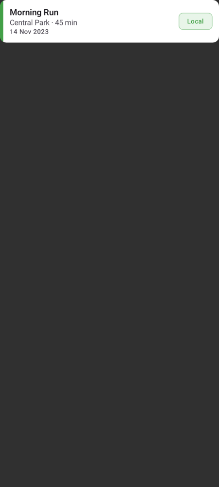
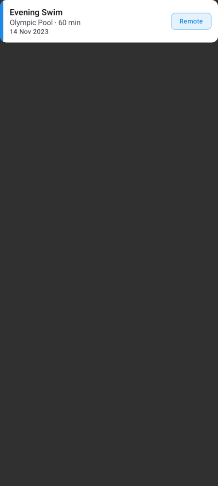
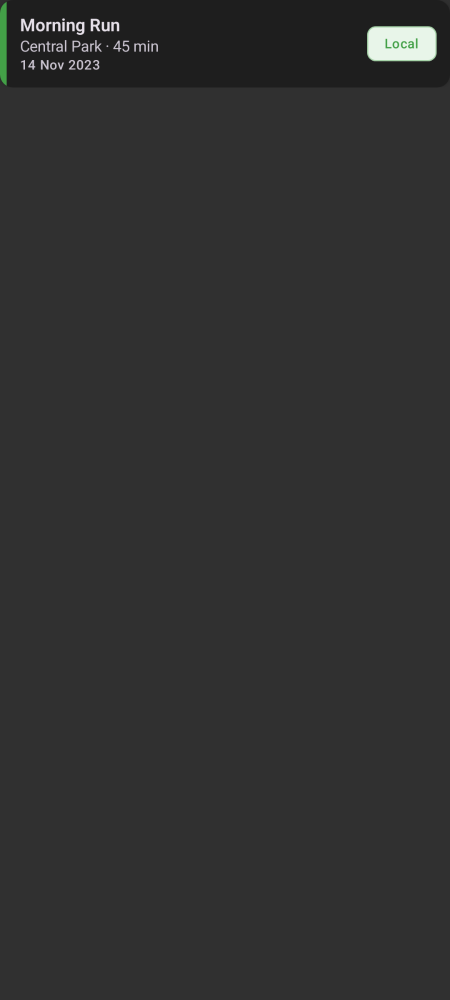
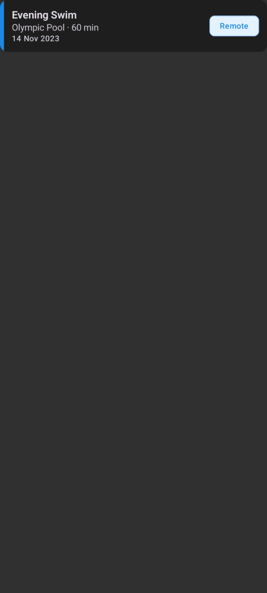

# Sport Activity Tracker

An Android app for recording and tracking sport activities, built as a demonstration of modern Android development best practices.

## Screenshots

| Local (Light) | Remote (Light) | Local (Dark) | Remote (Dark) |
|---|---|---|---|
|  |  |  |  |

> Generated with Paparazzi. Regenerate: `./gradlew :core:ui:recordPaparazziDebug`

## Features

- Add activities with name, location, and duration
- Save locally (Room) or remotely (Firebase Firestore)
- Filter by All / Local / Remote
- Color-coded cards — green for local, blue for remote
- Swipe to delete
- Portrait & landscape adaptive layout
- Offline support with automatic sync

## Tech Stack

| | |
|---|---|
| Language | Kotlin 2.2 |
| UI | Jetpack Compose + Material 3 |
| Architecture | Multi-module MVVM + MVI |
| DI | Hilt (KSP) |
| Local DB | Room |
| Remote | Firebase Firestore + Anonymous Auth |
| Navigation | Navigation Compose (type-safe) |
| Async | Coroutines + Flow |
| Testing | JUnit 4, MockK, Turbine, Paparazzi |

## Architecture

```
:app               → Entry point, DI, navigation
:core:domain       → Models, interfaces, use cases
:core:data         → Repository, Room, Firestore
:core:ui           → Shared Compose components, theme
:feature:list      → List screen
:feature:add       → Add screen
```

## Setup

1. Clone the repo
2. Place `google-services.json` in `app/`
3. Enable **Anonymous Authentication** and **Firestore** in Firebase Console
4. Run on API 28+

## Requirements

- Android Studio Meerkat+
- Min SDK 28 / Target SDK 36
- Kotlin 2.2
